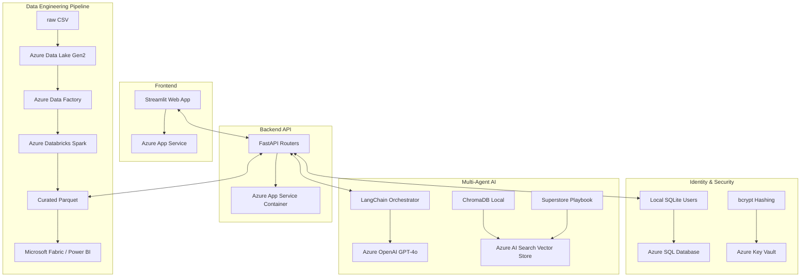

# RetailGPT: Azure Deployment Architecture

This document maps the local emulated architecture to an enterprise-grade Microsoft Azure deployment.

## Architecture Diagram (Mermaid)

## Component Mapping

| Local Component | Azure Native Service | Rationale |
|-----------------|----------------------|-----------|
| **FastAPI Backend** | Azure App Service (Web App for Containers) | Serverless scaling, easy VNet integration, native Docker support. |
| **Streamlit Frontend** | Azure App Service | Can be deployed as a separate tier to decouple UI scaling from API load. |
| **SQLite DB** | Azure SQL Database | Relational integrity, automated backups, Enterprise compliance. |
| **Data Pipeline (Pandas)** | Azure Databricks + Data Factory | Databricks handles the massive PySpark workloads; ADF orchestrates the triggers. |
| **File Storage** | Azure Data Lake Storage (ADLS Gen2) | Hierarchical namespace for Raw, Staged, and Curated zones. |
| **Power BI Export** | Microsoft Fabric (DirectLake) | Eliminates need for CSV export; Power BI connects directly to Parquet files in OneLake. |
| **LangChain + Groq** | Azure OpenAI Service | Enterprise SLAs, data privacy (no training on user data), RBAC controls. |
| **ChromaDB (RAG)** | Azure AI Search | Built-in semantic ranking, hybrid search, integrates seamlessly with Azure OpenAI. |

## CI/CD Pipeline

The current `.github/workflows/cicd.yml` is prepared to interface with Azure:
1. **Build**: GitHub Actions builds the Docker image.
2. **Push**: Pushes the image to **Azure Container Registry (ACR)**.
3. **Deploy**: Triggers a webhook on the Azure App Service to pull the latest image.

## Migration Checklist

- [ ] Provision Azure SQL and run migration script to move existing `users` and `uploads` tables.
- [ ] Upload `train.csv` to ADLS Gen2 `raw/` container.
- [ ] Migrate `data_pipeline.py` logic to a Databricks Notebook.
- [ ] Provision Azure OpenAI and update `.env` (or Key Vault) with `AZURE_OPENAI_API_KEY`.
- [ ] Push local Docker image to ACR.
- [ ] Connect Power BI Service directly to the Fabric workspace.
